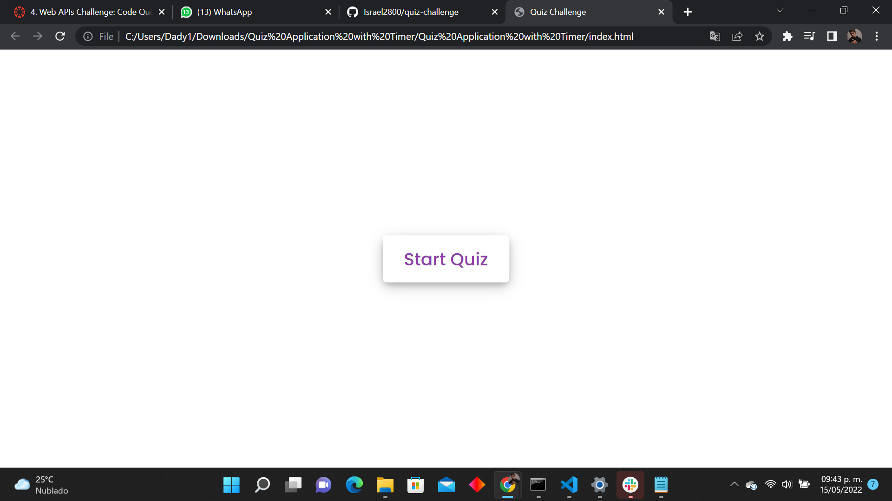
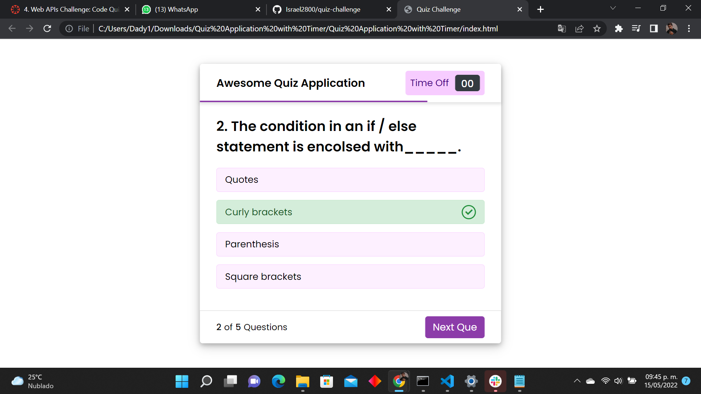
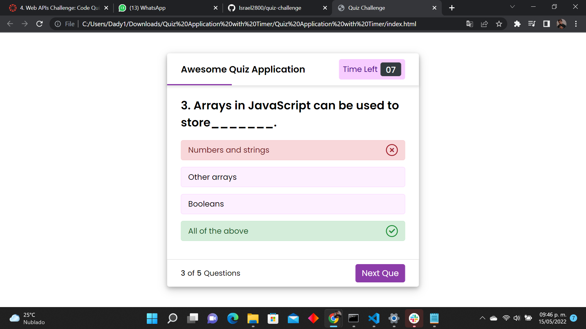
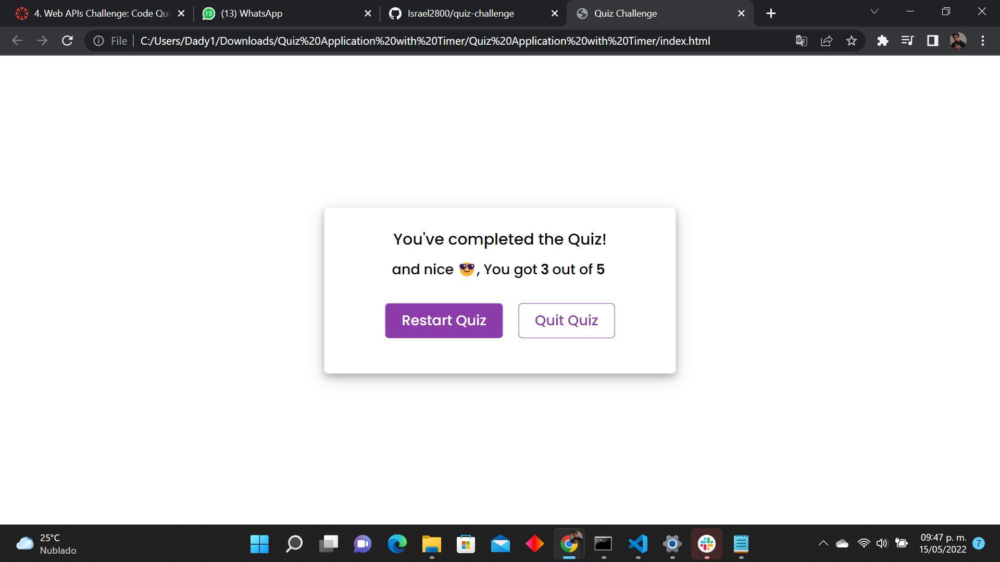

# Coding Quiz

## Purpose
A quiz with different types of coding questions, it let you know the difference between similar concepts we normally use. In a different version you could be able to registrate your score and see the highscore of other users! 

## Built With
* HTML
* CSS
* JavaScript

## Screenshots

## Website
https://israel2800.github.io/quiz-challenge/

## GitHub Repository
https://github.com/Israel2800/quiz-challenge

## Contribution
Made with ❤️ by [Israel Aguilar]

### ©️2022 Quiz Challenge